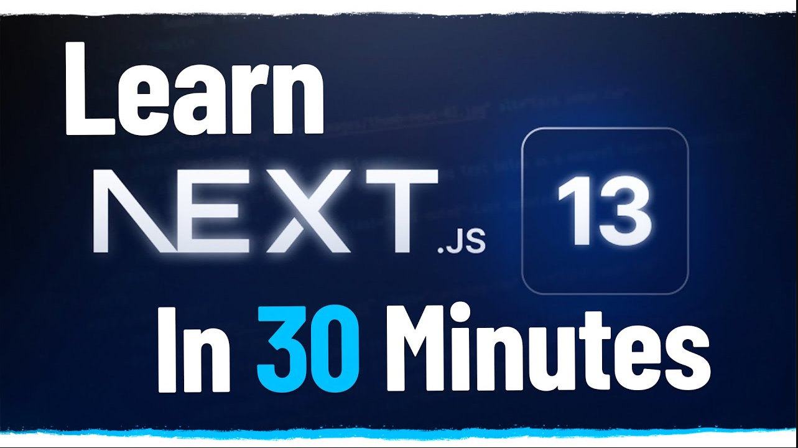

# Learn Next.js 13 With This One Project

https://www.youtube.com/watch?v=NgayZAuTgwM&ab_channel=WebDevSimplified

> Next.js is constantly evolving and one of the biggest updates is the addition of server components and server actions. This video goes over all the new Next.js 13 changes and how you can use these new features to create a simple todo list application.

Project --> **Todo List**  
Channel --> **Web Dev Simplified 1,42 mi de inscritos**  
Date Created --> **23 de mai. de 2023**

### Observations

-  npx create-next-app@latest
-  tailwind
-  typescript
-  prisma for db setup
-  client and server components
-  app source folder
-  dotenv

### Components

-  page.tsx (server)
-  layour.tsx
   -  newTodo page (server)
   -  TodoItem item (client)
       
       

⏱️ Timestamps 
00:00 - Introduction 
00:44 - Setup 
01:50 - Database Setup 
05:45 - Remove Boilerplate Code 
07:20 - Next.js 13 Routing 
08:35 - Home Page 
10:41 - Server Component Data Fetching 
17:34 - New Todo Page 
20:24 - Server Actions (Forms) 
25:20 - Server Actions (Buttons)
